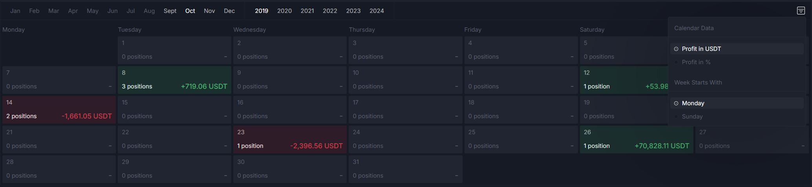

# SCREENING QUESTIONS #

Questions for C#.NET applicants.

### Question 1 ###

Describe us some challenging problem you faced that you are specifically proud how you solved

I am very fond of solving performance issues in the .net applications and got appreciation from the Platform arhitect from last company I worked with.
There was a section of notificationf for users and data was being retrieved from multiple joins for notifications For example: Notification Data itself was from notifications table, Notifcation came from (name , avatar ) from different table etc. I checked the join was right, Checked the referencial tables, Indexes everything seems to be fine, and then I check the query which was being executed the SQL itself, There was reference tables was being lazy loaded in the C# code in a for loop. So When 50 notifications were retrieved and then in a loop avatar url was being constructed from db information and API base resource url it was fetching the reference objects by querieg database again in a loop. SO to retrieve 50 notifications, there was 51 calls to databases. That function have a 8 references to different part of code. To not break other parts, I introduced the boolean param to that function and if that was provided as true then the refrencial tables was inluded in the first query which makes it faster as instead of calling db 51 times, it retrieves data in one query.
This signifately solved the problem and I am proud of identifying the performance bootleneck and fix it.

### Question 2 ###

What was the last think you learned in context of C#.NET and how do you make sure you keep up with ever so evolving world of C#.NET
I always keep an eye on new blogs from Microsoft Learning on LinkedIn, Medium or other blogs. I have connected with latest knowledge sharing peoples on LinkedIn and I always learn from their posts and read articles they attached.
Recently I learened about the Any() and Exists() functions performance updates for .Net 9 and how it actually works under the hood.
Reference article:  [Link to article](https://medium.com/@vikpoca/any-vs-exists-in-net-9-why-your-old-performance-assumptions-might-be-wrong-5570e65c878f#id_token=eyJhbGciOiJSUzI1NiIsImtpZCI6ImJhYTY0ZWZjMTNlZjIzNmJlOTIxZjkyMmUzYTY3Y2M5OTQxNWRiOWIiLCJ0eXAiOiJKV1QifQ.eyJpc3MiOiJodHRwczovL2FjY291bnRzLmdvb2dsZS5jb20iLCJhenAiOiIyMTYyOTYwMzU4MzQtazFrNnFlMDYwczJ0cDJhMmphbTRsamRjbXMwMHN0dGcuYXBwcy5nb29nbGV1c2VyY29udGVudC5jb20iLCJhdWQiOiIyMTYyOTYwMzU4MzQtazFrNnFlMDYwczJ0cDJhMmphbTRsamRjbXMwMHN0dGcuYXBwcy5nb29nbGV1c2VyY29udGVudC5jb20iLCJzdWIiOiIxMDUzNjQxMTQwNDkxNzA5MDk3NDYiLCJlbWFpbCI6Ijc4NmhhbW1hZHNhamlkQGdtYWlsLmNvbSIsImVtYWlsX3ZlcmlmaWVkIjp0cnVlLCJuYmYiOjE3NDgyNTM0MjAsIm5hbWUiOiJIYW1tYWQgU2FqaWQiLCJwaWN0dXJlIjoiaHR0cHM6Ly9saDMuZ29vZ2xldXNlcmNvbnRlbnQuY29tL2EvQUNnOG9jTGtuWV8tQ2J4Mnd3UmpDZUktQTRWUU00dlZWSUtJZk5lSGRCX3JSZTBMOFh6SXdoUUh0Zz1zOTYtYyIsImdpdmVuX25hbWUiOiJIYW1tYWQiLCJmYW1pbHlfbmFtZSI6IlNhamlkIiwiaWF0IjoxNzQ4MjUzNzIwLCJleHAiOjE3NDgyNTczMjAsImp0aSI6Ijg5YWQzOGVlZWVkMjhiNTQ3YzhmZDg0MTdiYWM3MzhlZmViYzYzODQifQ.WMjT1BLnKqquq48QBZb5uGziMFEkTZniJamhaig8aM7h1-CWpexNHCBvYoKC693_eA-Et6az7HUyVfB93ulv9FIbLxSjLVBVxj34GBQfWwMbuhKakNMbpwWb7CYCQyupHByMt2OU4gXFuNCATT43cip57so5U11Ik7eOafFSx6OeiaVv-vS5oSYpvSmsfrx__rEE73Dau_5NN6X_Jl7nQaX78NpOUsQFJ7CAPyQzJXXpbJm1jUimiOBYJvlI0xgdsC0QLrKY2mhLjNO-ZEQsvwpFose8FM1HbeR-Qb8MhXSh4VSAVJTReutgpyU63mWH_AFrXht-OWNg6M-HLqFz0A)

### Question 3 ###

Imagine you will receive design for new feature from designer and you are supposed to implement single BE API endpoint for this new feature for FE devs, write data structure (aka response model) you would use for such endpoint (with some caviats that you might not want to do in real word application for sake of challenge)

this is the feature design:

 

        class ResponseModel{

         List<Position> OpenPositions{get;}

         public FetchOpenPositions(DateTime range){
           return new List<Position>(); // Logic here for fetching records from db
         }
        }

        class Position{
        public DateTime CreatedDate {get;set;}
        public Decimal Price {get;set}
        public CryptoCurrency Currency {get;set}
        public int NoOfOpenPositions {get;set}
        }
        
        public Enum CryptoCurrency{
        USDT = 0 ....
        }

